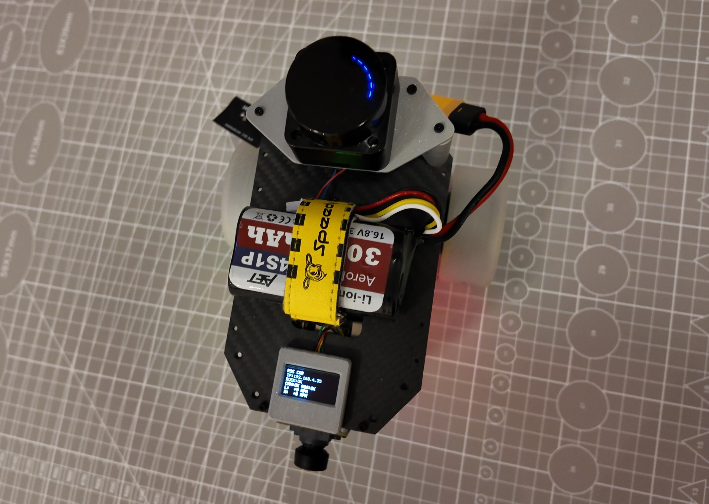

# OpenRover ROS 2

A full-stack rover platform that combines embedded firmware, Linux-based robot software, ROS 2 middleware, and autonomous navigation.



## Overview

This repository contains the complete software and hardware support stack for an open-source rover built around STM32 microcontrollers and ROS 2. It spans the full robot development pipeline:

- Embedded firmware for motor control, CAN/serial communication, and low-level device interfaces
- ROS 2 packages for robot bring-up, odometry, TF, sensor integration, and motion control
- Linux-side workflows for SLAM, navigation, teleoperation, and visualization
- Mechanical and documentation assets, including 3D models and setup guides

## What this project includes

### Embedded layer
- STM32CubeIDE projects for rover motor control and hardware integration
- Firmware targets such as the G431-based rover project and the STM32F103-based ROS 2 car project

### Robot software layer
- ROS 2 workspaces for base drivers, robot description, bring-up, and navigation-related packages
- Support for distributed robotics setups across Rock 5C, Jetson Nano, and Linux PCs

### Applications and autonomy
- Keyboard teleop and RViz-based visualization
- LiDAR-based SLAM and Nav2 navigation workflows
- Mapping, exploration, and basic autonomous operation demos

## Repository structure

- G431CBU6-Rover/: rover-related firmware and project assets
- STM32F103C8T6_ros2_car/: STM32F103-based firmware project
- Linux/: Linux and embedded-side ROS 2 workspace examples for Jetson Nano, Rock 5C, and PC use cases
- Ubuntu-22/: additional ROS 2 workspace and tools for Ubuntu-based development
- Images/: project images, including top.jpg
- 3D model/: mechanical CAD assets for the rover chassis and wheels

## Typical architecture

```text
STM32 MCU / motor controller
        │
        ▼
ROS 2 robot base stack
        │
        ▼
Linux computer (Rock 5C / Jetson / PC)
        │
        ▼
SLAM + Nav2 + RViz + teleop workflows
```

A typical setup uses:
- STM32 firmware for low-level motion control
- ROS 2 on a Linux host for communication, TF, and higher-level control
- LiDAR and odometry data for mapping and navigation

## Getting started

1. Review the hardware and software guides in the Linux and Ubuntu folders.
2. Build and flash the desired STM32 firmware project in STM32CubeIDE.
3. Set up the ROS 2 workspace on the target Linux machine.
4. Launch the base bring-up and then run teleop, SLAM, or navigation workflows as needed.

### Useful references
- Linux/Rock5c/Getting-Start/README_KEYBOARD_TELEOP_RVIZ.md
- Linux/Rock5c/Getting-Start/README_ROS2_LD06_SLAM_NAV2.md
- Linux/Rock5c/Getting-Start/readme.md

## License

This project is licensed under the MIT License. See the LICENSE file for details.
