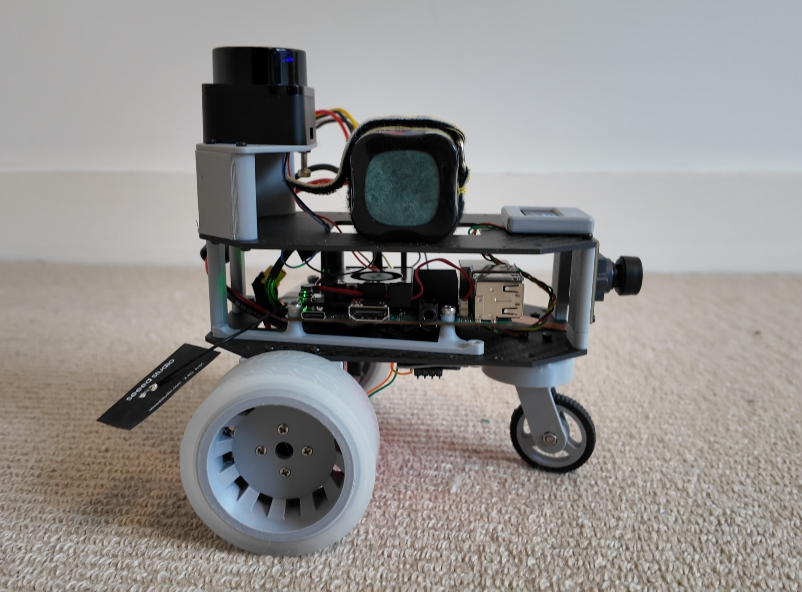
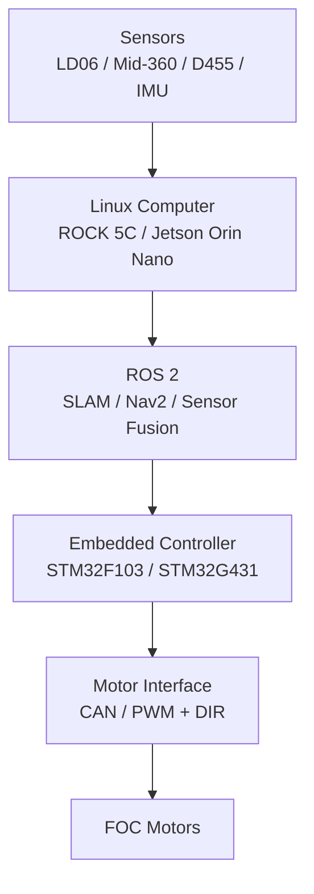

# OpenRover ROS 2

A modular, full-stack mobile robotics platform combining STM32 firmware, Linux-based robot software, ROS 2 middleware, SLAM, and autonomous navigation.

The project provides two embedded controller options and two onboard computer configurations. Each layer is designed to remain modular, allowing different controllers, computers, and LiDAR sensors to be combined without rewriting the complete software stack.

## Platform Configurations

### OpenRover Light

A compact 2D SLAM and navigation platform designed for learning, development, and low-cost deployment.

**Hardware**

* STM32F103 motor controller
* JC FOC motor drivers
* Radxa ROCK 5C
* LD06 2D LiDAR
* Differential-drive chassis

**Current capabilities**

* Keyboard teleoperation
* Wheel odometry
* ROS 2 TF publishing
* 2D LiDAR visualization
* SLAM map generation
* Map saving and loading
* Nav2-based autonomous navigation

[Watch the video](https://youtu.be/SysfDb_uuPQ)


---

### OpenRover Plus

A higher-performance platform intended for 3D perception, sensor fusion, and more advanced autonomous robotics development.

**Planned hardware**

* STM32G431 motor controller
* Four integrated FOC wheel motors
* NVIDIA Jetson Orin Nano
* Livox Mid-360 3D LiDAR
* Intel RealSense D455 RGB-D camera
* BMI088 IMU

**Development goals**

* micro-ROS-based embedded communication
* Four-wheel skid-steer control
* IMU and wheel-odometry fusion
* 3D LiDAR SLAM
* RGB-coloured point clouds
* Autonomous exploration
* Navigation in unknown environments

**Status:** Under active development
**Demo video:** Coming soon
**Image:** Coming soon

## System Architecture



## Modular Design

OpenRover is not limited to fixed “Light” and “Plus” configurations.

The main components are designed as interchangeable layers:

| Layer               | Available options                                         |
| ------------------- | --------------------------------------------------------- |
| Embedded controller | STM32F103 or STM32G431                                    |
| Linux computer      | Radxa ROCK 5C or NVIDIA Jetson Orin Nano                  |
| ROS 2 communication | UART text protocol or micro-ROS                           |
| LiDAR               | LD06 2D LiDAR or Livox Mid-360 3D LiDAR                   |
| Camera              | Intel RealSense D455                                      |
| Navigation          | 2D SLAM and Nav2, with 3D autonomy planned                |
| Motor control       | CAN-based FOC control or 25 kHz PWM and direction control |

The long-term goal is to keep the ROS 2 interfaces consistent so that hardware components can be replaced without redesigning the entire application layer.

## Features

### Embedded Firmware

#### STM32F103

* CAN communication with FOC motor controllers
* UART command interface between Linux and STM32
* Plain-text velocity commands for debugging
* Motor command watchdog
* Wheel feedback reporting
* 0.96-inch OLED status display

#### STM32G431

* micro-ROS communication
* Four-wheel motor control
* 25 kHz PWM output
* Direction and brake control
* FG wheel-speed feedback
* Designed for odometry and diagnostic publishing

### ROS 2 Robot Software

* Differential-drive and skid-steer rover support
* `/cmd_vel` velocity command handling
* Wheel odometry publishing
* `odom -> base_link` TF publishing
* Robot description and RViz visualization
* Sensor drivers and launch files
* Keyboard teleoperation
* SLAM workflows
* Saved-map localization
* Nav2 navigation

### Perception and Autonomy

* LD06-based 2D mapping
* RViz goal-based navigation
* Obstacle-aware path planning
* Mid-360 3D perception integration — planned
* D455 RGB-D integration — planned
* RGB-coloured point-cloud mapping — planned
* Autonomous exploration — planned

## Repository Structure

```text
OpenRover/
├── G431CBU6-Rover/
│   └── STM32G431 rover firmware and related assets
├── STM32F103C8T6_ros2_car/
│   └── STM32F103 rover firmware
├── Linux/
│   └── ROS 2 workspaces, packages, launch files, and configuration
├── Ubuntu-22/
│   └── Additional Ubuntu-based ROS 2 development tools
├── Images/
│   └── Project photos, diagrams, and documentation assets
├── 3D model/
│   └── Rover chassis and wheel CAD assets
├── LICENSE
└── README.md
```

## Project Status

| Component                       | Status      |
| ------------------------------- | ----------- |
| STM32F103 motor control         | Working     |
| ROCK 5C ROS 2 integration       | Working     |
| Keyboard teleoperation          | Working     |
| Wheel odometry and TF           | Working     |
| LD06 visualization              | Working     |
| 2D SLAM                         | Working     |
| Map saving and loading          | Working     |
| Nav2 integration                | In progress |
| STM32G431 micro-ROS firmware    | In progress |
| Four-wheel rover integration    | In progress |
| IMU sensor fusion               | Planned     |
| Mid-360 3D SLAM                 | Planned     |
| D455 colour point-cloud mapping | Planned     |
| Autonomous exploration          | Planned     |

## Getting Started

Detailed setup guides will be provided for each supported configuration:

1. Build and flash the STM32 firmware.
2. Install ROS 2 on the onboard Linux computer.
3. Build the OpenRover ROS 2 workspace.
4. Connect the embedded controller and sensors.
5. Verify motor control, odometry, and TF.
6. Run teleoperation.
7. Build and save a map.
8. Launch localization and Nav2 navigation.

Configuration-specific instructions will be added under the relevant firmware and ROS 2 workspace directories.

## Roadmap

* [x] STM32F103 motor-control firmware
* [x] UART communication between ROS 2 and STM32
* [x] Wheel odometry and TF
* [x] LD06 integration
* [x] 2D SLAM workflow
* [ ] Complete and document Nav2 workflow
* [ ] Complete STM32G431 micro-ROS integration
* [ ] Add BMI088 IMU fusion
* [ ] Integrate Livox Mid-360
* [ ] Integrate Intel RealSense D455
* [ ] Generate RGB-coloured 3D point clouds
* [ ] Implement autonomous exploration
* [ ] Add automated tests and CI
* [ ] Publish complete build and demonstration videos

## Project Goals

OpenRover is both a practical robotics platform and a software-engineering portfolio project. It demonstrates experience across:

* C and C++ embedded development
* STM32 motor-control firmware
* ROS 2 node and interface design
* Linux robotics deployment
* Odometry and coordinate transforms
* SLAM and autonomous navigation
* Sensor integration and fusion
* Full-system debugging
* Simulation-to-real and hardware integration workflows

## License

This project is licensed under the MIT License. See [LICENSE](LICENSE) for details.
